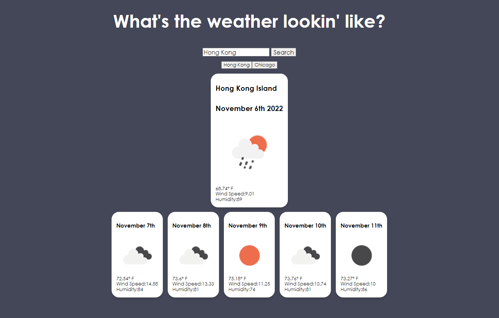

# Weather Dashboard
## Description

The primary goal of this project is to create a simple weather app that retrieves data using the OpenWeather API. The secondary goal was to practice using fetch requests, parsing through fetched data, and displaying selected data for the user. Also utilized Local Storage for saved searches, and retrieving items from local storage.

## Installation

You can open the webpage in your web browser using this URL: https://gyao1487.github.io/weather-app/

## Usage
Features implemented on this webpage:
* When a city is entered in the search bar, the weather conditions for that city (temperature, visual representation of weather conditions, wind speed, and humidity) and the current date are displayed.
* Dates and weather conditions for the following 5 days are displayed below the main display.
* Recently searched cities appear as buttons underneath the search bar when user returns to the webpage
* Clicking buttons for previously searched cities will bring up weather data from those cities.
* Duplicate searches will not create new buttons

## Credits
Referenced the following resources to complete this project:
* https://openweathermap.org/forecast5#call 
* https://bobbyhadz.com/blog/javascript-cannot-set-property-textcontent-of-null
* https://www.quora.com/How-do-you-insert-an-image-in-Javascript
* https://www.folkstalk.com/2022/09/javascript-array-same-class-elements-with-code-examples.html
* https://stackoverflow.com/questions/27884528/using-a-for-loop-to-append-multiple-images-in-javascript
* https://bobbyhadz.com/blog/javascript-check-if-element-contains-text#:~:text=To%20check%20if%20an%20element,true%20%2C%20otherwise%20false%20is%20returned.
* https://dev.to/soyleninjs/3-ways-to-remove-duplicates-in-an-array-in-javascript-259o
* Ivy Wirsing and Juno Nguyen for guidance on fetch/API requests

## License
Please refer to the LICENSE in the repo.
